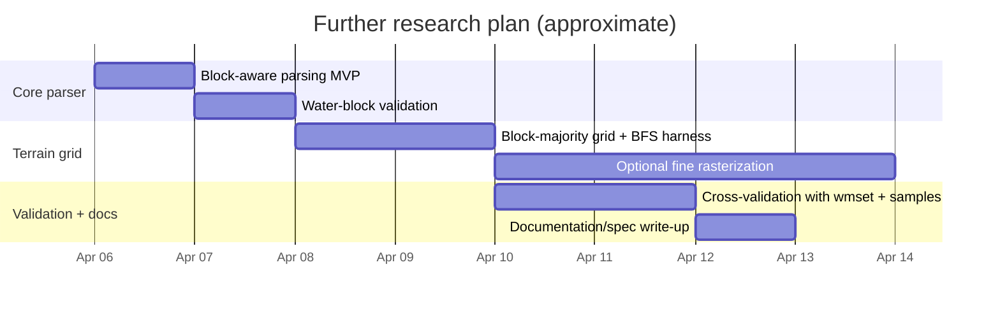

# Deep Research Report: wmx.obj Segment and Terrain Byte Location

## Executive summary

The attached prompt (a deep-research request) asks where the “terrain / ground type” byte actually lives inside the FF8 world-map geometry container `wmx.obj`, so that a land/ocean grid can be built for BFS reachability filtering in an accessibility mod. fileciteturn0file0

Across multiple independent community sources—especially (a) reverse-engineering documentation and (b) a working converter implementation—the consensus structure is: `wmx.obj` is split into fixed-size **segments** of **0x9000 (36,864) bytes**, each beginning with a **68-byte header (4-byte group ID + 16×4-byte offsets)**; each offset points to a variable-length **block**, and each block starts with a **4-byte per-block header** containing **polygon count**, **vertex count**, and **normal count**. citeturn8view0turn15view0turn15view4

Within each block, the **polygon (triangle) record is 16 bytes**, and the **ground type byte is at polygon offset 13 (0x0D)**—exactly the byte the prompt is chasing. citeturn8view0

The prompt’s “728-byte block” observation is best explained as a **special-case “water block”**: community docs describe sea blocks as **32 polygons** and **1 normal**; with a 4×4 grid of squares, that implies **25 vertices** (a 5×5 grid). Those counts produce a used block size of **4 + 32×16 + 25×8 + 1×8 + 4 = 728 bytes**, matching the prompt’s stride. citeturn8view0turn14view0

Finally, the “unknown 25,148 bytes” after the last block in the prompt is very likely **unused padding to the fixed 0x9000 segment size**, consistent with early forum reverse-engineering descriptions of trailing zeros/padding. citeturn14view0turn8view0

## Scope, objectives, and context

The attached prompt describes a project goal: parse `wmx.obj` (extracted from the FF8 `world.fs` archive) to build a **terrain classification grid (land vs ocean at minimum)** to support BFS reachability filtering (presumably for routing/interaction logic in an accessibility layer). fileciteturn0file0

The file-level scope in the prompt is specific: `wmx.obj` is ~30.8 MB and consists of **835 segments × 36,864 bytes/segment**. fileciteturn0file0turn8view0 The reverse-engineering documentation corroborates that `wmx.obj` is world-map **geometry only**, with collision derived directly from faces, and that the 835 segments include the main 32×24 world map plus story/variant segments beyond that. citeturn8view0turn20view0

A key contextual detail for a BFS terrain grid is the spatial tiling: sources describe **32 segments horizontally × 24 vertically** for the main world map, and **16 blocks per segment arranged in a 4×4 layout** (i.e., a potential **128×96 block grid** if you choose “one cell per block”). citeturn8view0turn15view0turn15view5 The same docs define a block-local bounding box of **2048×2048 units**, which matches the converter code’s constants and is relevant for mapping triangle vertices onto grid coordinates. citeturn8view0turn15view0turn15view5

## Key questions and hypotheses

The prompt’s key questions (paraphrased) are: (a) what is the exact segment and block layout; (b) are polygons inside the 728-byte sub-blocks or in the remainder of the segment; (c) is the polygon record really 16 bytes with ground type at 0x0D; and (d) does a per-block header exist to locate polygon vs vertex regions. fileciteturn0file0

The strongest working hypotheses supported by community reverse-engineering are:

A segment is “header + packed blocks + padding”, where the **68-byte header** contains a **group ID** and **16 offsets** into the segment (one per block). citeturn8view0turn15view2turn15view4

Each block is self-describing and begins with a **4-byte header of counts** (polygons, vertices, normals), so polygon data can be located without scanning the whole segment at a fixed stride. citeturn8view0turn15view4

The “728-byte block” seen in the prompt is not a global constant; it most plausibly corresponds to the well-documented “water block” case (32 polygons, 1 normal), which numerically implies 25 vertices and exactly 728 bytes of used data. citeturn8view0turn14view0

The segment “remainder” after the last block is typically padding/unused bytes up to 0x9000, consistent with forum descriptions of fixed-size segments padded with zeros. citeturn14view0turn8view0

## Methodology and sources prioritized

This research combined (1) extraction of requirements from the attached prompt, and (2) triangulation across multiple independent technical sources that are directly about FF8 world-map formats and code that parses them. fileciteturn0file0

Source prioritization followed a “most primary first” rule:

Reverse-engineered format documentation that provides explicit byte-level layouts, offsets, and element sizes (segment header, block header, polygon/vertex formats). citeturn8view0turn17view0

Working parser/converter source code (used as an executable “spec” of what actually parses in practice), including constants and how offsets/counts are read and bounds-checked. citeturn15view0turn15view4turn15view5

Community forum threads documenting hex-level exploration, especially where they explicitly confirm fixed segment size, 68-byte headers, and padding behavior (useful for interpreting the prompt’s “unknown trailing bytes”). citeturn14view0turn20view0

Auxiliary documentation for semantic mappings (terrain ID → terrain meaning, world-map coordinate conventions) to support “terrain grid” implementation details. citeturn19view0turn18view0

Where sources disagree (common in early reverse engineering), later consolidated documentation “based on converter source code” was treated as higher-confidence than early exploratory forum claims, while still noting inconsistencies as limitations. citeturn8view0turn14view0

## Findings and evidence

The core result is that the polygon terrain byte is not at a fixed 16-byte stride from the start of the segment. It is at a fixed offset inside **each 16-byte polygon record**, inside **each block**.

**Segment-level layout (0x9000 bytes)**  
Reverse engineering documentation describes each segment as 0x9000 bytes with a 68-byte header: 4-byte group ID and 16×4-byte offsets to blocks. citeturn8view0 Early forum work independently confirms a 68-byte header and that offsets follow immediately after the first 4 bytes. citeturn14view0 A converter implementation parses the segment header the same way: it treats the first 4 bytes as group ID and then reads each block offset as a little-endian uint32. citeturn15view2turn15view4

A practical implication: for a given segment, you do **not** “scan every 16 bytes from segment start”; you compute `blockStart = segmentBase + blockOffset[i]` first, then parse within the block. citeturn8view0turn15view4

**Block-level layout (variable length within the segment)**  
Documentation gives a clear structure: each block begins with a 4-byte header containing (byte0) polygon count, (byte1) vertex count, (byte2) normal count, (byte3) padding. Then come polygons, then vertices, then normals, then 4 bytes padding. citeturn8view0

The converter code uses exactly this interpretation for bounds checking and iteration order: it reads `num_polys`, `num_verts`, `num_norms` from the first three bytes at the block start, then advances past the 4-byte header and iterates polygons in 16-byte strides followed by vertices in 8-byte strides. citeturn15view4turn15view5

This directly answers the prompt’s “per-block header” question: yes—polygon count and vertex count are explicitly available in the first bytes of the block. citeturn8view0turn15view4

**Polygon (triangle) record format and terrain byte location**  
The polygon record is documented as **16 bytes**, with fields including three vertex indices, three normal indices, three UV pairs, a texture-page/CLUT nibble field, and finally the ground type byte at offset 13. citeturn8view0

That ground type byte is precisely the `0x0D` offset discussed in the prompt. fileciteturn0file0 The existence and position of the ground type byte is strengthened by the fact that the same “ground ID” concept is referenced elsewhere in world-map systems: the `wmsetxx.obj` documentation describes encounter selection as depending on `(regionID, groundID)` pairs, implying the engine needs a ground ID per step location, consistent with ground type being a per-triangle attribute in world geometry. citeturn17view0

**Vertex and normal record format**  
The same documentation defines vertex and normal records as **8 bytes**: three signed 16-bit coordinates (with the middle axis described as `-Z`) and 2 bytes padding. citeturn8view0 The converter’s constants match the 8-byte stride (`VERTEX_SIZE 8`, `NORMAL_SIZE 8`) and it applies a block/segment origin offset based on a 2048-unit block size and 8192-unit segment size, consistent with the documented 2048×2048 block bounding box and 32×24 segment tiling. citeturn15view0turn15view5turn8view0

**Explaining the prompt’s “728 bytes per block” observation**  
The prompt reports segment 0’s block offsets as evenly spaced by 728 bytes. fileciteturn0file0 Using the documented block structure, the used size of a block is:

`blockUsedBytes = 4 + (polyCount × 16) + (vertCount × 8) + (normCount × 8) + 4` citeturn8view0turn15view4

The “Block explained” section states that a **water block has 32 polygons (triangles) and only 1 normal**. citeturn8view0turn14view0 Plugging those counts into the size equation:

`728 = 4 + 32×16 + vertCount×8 + 1×8 + 4` → `vertCount = 25`.

A 4×4 grid of squares subdivided into 2 triangles each has exactly **32 triangles** and **5×5 = 25 vertices**, which aligns with the “4×4 grid per segment block” description. citeturn8view0turn14view0

So, the “728-byte block” is strong evidence that the inspected segment was dominated by water blocks, and that the offsets were pointing to the start of each block’s count header—not to some separate polygon region later in the segment. citeturn8view0turn15view4

**What is the “unknown region” after the last block?**  
The prompt observes 25,148 bytes after the end of the 16 blocks in segment 0. fileciteturn0file0 Multiple sources describe segments as fixed-size containers with “padding” (often zeros) filling the remainder after the actual block data. citeturn14view0turn8view0 This strongly suggests the tail region is not an additional data structure but simply unused bytes to round the segment up to 0x9000.

This matters because it resolves the prompt’s core ambiguity: the polygon terrain bytes are **not** in a special “post-blocks” zone; they are **inside each block’s polygon array**, and any “extra” bytes after the last referenced block are usually padding. citeturn8view0turn14view0turn15view4

**Terrain ID semantics for land/ocean classification**  
The prompt mentions several terrain values (e.g., 32/33/34 for ocean). fileciteturn0file0 The `wmTerrain.md` mapping in the FF8 memory research repository defines the same codes: 32 = “Ocean - Shallow”, 33 = “Ocean - Light”, 34 = “Ocean - Dark”, plus roads, railroads, city/town, forest variants, etc. citeturn19view0

This mapping is sufficient to implement a minimum viable BFS “walkable land” mask (e.g., treat {32,33,34} as water; everything else as land), then refine later for vehicles/locomotion constraints (e.g., road-only vehicles, shallow-water traversal, etc.). citeturn19view0turn17view0

**Practical extraction offsets (answering “exact byte offsets I can use”)**  
Given `segmentBase` (file position of segment start) and `blockOffset[i]` (uint32 from segment header), the ground type for polygon `p` in that block is at:

`groundTypePos = segmentBase + blockOffset[i] + 4 + (p * 16) + 13` citeturn8view0turn15view4turn15view5

Where `4` skips the block header, `16` is polygon size, and `13` is the ground type index within the polygon. citeturn8view0turn15view0

**Proposed C struct layouts (directly aligned with the documented format)**  
The following struct definitions mirror the documented field sizes and the converter’s traversal order. (These are descriptive layouts; you still need to treat the blocks as variable-length, because counts vary by block.)

```c
#pragma pack(push, 1)

typedef struct {
    uint32_t group_id_le;      // 0x00..0x03
    uint32_t block_ofs_le[16]; // 0x04..0x43 (absolute offsets from start of segment)
    // followed by block data at the given offsets; remainder of segment is typically padding
} WmxSegmentHeader;

typedef struct {
    uint8_t poly_count;   // number of 16-byte polygons
    uint8_t vert_count;   // number of 8-byte vertices
    uint8_t norm_count;   // number of 8-byte normals
    uint8_t pad;          // usually 0
    // followed by:
    // WmxPolygon polys[poly_count];
    // WmxVertex  verts[vert_count];
    // WmxNormal  norms[norm_count];
    // uint32_t end_pad;
} WmxBlockHeader;

typedef struct {
    uint8_t v_index[3];   // triangle vertex indices
    uint8_t n_index[3];   // triangle normal indices
    uint8_t uv1[2];       // U1,V1
    uint8_t uv2[2];       // U2,V2
    uint8_t uv3[2];       // U3,V3
    uint8_t tex_clut;     // 4-bit texture page, 4-bit CLUT id (packed)
    uint8_t ground_type;  // offset 0x0D (13) within polygon
    uint8_t unk14;
    uint8_t unk15;
} WmxPolygon; // size 16

typedef struct {
    int16_t x;
    int16_t neg_z;
    int16_t y;
    uint16_t pad;
} WmxVertex; // size 8; normals share same layout in docs

#pragma pack(pop)
```

citeturn8view0turn15view0turn15view4turn15view5

**A diagrammatic view of the data relationships**  
(Description for screen readers: a segment contains a header with offsets; each offset points to a block; each block contains a count header followed by polygon, vertex, and normal arrays; each polygon contains the ground type byte.)

```mermaid
flowchart TD
  A[wmx.obj file] --> B[Segment n (0x9000 bytes)]
  B --> C[Segment header (68 bytes): group_id + 16 offsets]
  C --> D1[Block 0 @ offset[0]]
  C --> D2[Block 1 @ offset[1]]
  C --> D3[...]
  C --> D16[Block 15 @ offset[15]]

  D1 --> E[Block header (4 bytes): poly_count, vert_count, norm_count]
  E --> F[Polygons: poly_count × 16 bytes]
  E --> G[Vertices: vert_count × 8 bytes]
  E --> H[Normals: norm_count × 8 bytes]
  F --> I[ground_type byte at polygon + 0x0D]
  B --> P[Unused/padding up to 0x9000]
```

citeturn8view0turn15view4turn14view0

## Contrasting viewpoints and limitations

**Early forum interpretations vs consolidated documentation**  
Earlier Qhimm forum exploration identified the 68-byte segment header and 16-byte triangles, but some field interpretations were tentative (the author explicitly warns the info may be inaccurate) and includes hypotheses like “render/collision options” for the first 4 bytes of block data and “ground type?” speculation tied to later bytes. citeturn14view0 The later consolidated documentation (explicitly stating it is based on wmx2obj source code) provides a cleaner, count-driven block layout and a specific ground type byte at polygon offset 13. citeturn8view0

A reasonable reconciliation is: the “render/collision options” bytes likely overlap with or include the block count header; setting them to zero can remove geometry by making polygon/vertex counts zero, even if the author interpreted it differently at the time. citeturn14view0turn8view0

**No direct validation on the user’s actual binary was possible here**  
This report relies on public documentation and source code; it does not parse or confirm the contents of the user’s exact extracted `wmx.obj`. fileciteturn0file0 While the structure is strongly corroborated across sources, implementation details (e.g., endianness assumptions in edge cases, non-zero padding in some segments, or version-specific quirks) should be verified by running a small parser against the user’s file and checking invariants (counts, bounds, distributions). citeturn15view4turn8view0

**Semantic limits of “ground type”**  
The terrain values in `wmTerrain.md` are useful labels, but they do not directly specify traversal rules (e.g., “walkable by foot” vs “walkable by car” vs “landable by Ragnarok”). Encounter logic explicitly depends on both region and ground IDs, but movement/interaction constraints may depend on additional factors beyond `wmx.obj` (scripts, location flags, story state, etc.). citeturn17view0turn19view0

**A potentially easier alternative data source may exist for coarse grids**  
`wmsetxx.obj` contains a 32×24 “region map” (section 2) used for encounter logic and multiple world-map subsystems. citeturn17view0 This is not a direct “ground type map,” but it is a strong hint that some world-map state is already stored in grid form elsewhere. A future direction is to confirm whether there is also a ground/terrain bitmap or lookup table that could replace or validate polygon rasterization, but that is outside what the current prompt explicitly asked to parse from `wmx.obj`. citeturn17view0turn8view0

## Recommendations and further research plan

**Implement the minimal correct extraction path (block-aware ground type reads)**  
The prompt’s “16-byte stride from segment start” diagnostic produced identical distributions across segments, which is expected if the scan is not aligned to polygon boundaries inside blocks. fileciteturn0file0 The first implementation milestone should be a strict parser that:

Reads each 0x9000-byte segment and its 68-byte header; for each block, jumps to `blockOffset[i]` and reads the 3 count bytes. citeturn8view0turn15view4

Iterates polygons `p in [0..poly_count)` and reads `ground_type = polygon[p].ground_type` from `(blockStart + 4 + p*16 + 13)`. citeturn8view0turn15view5

Sanity-checks: `poly_count`, `vert_count`, `norm_count` must keep the block within segment bounds (the converter uses this exact bounds formula). citeturn15view4turn15view0

**Use the “728-byte water block” as a validation harness**  
Because water blocks are structurally regular (32 polys, 25 verts, 1 normal) and should show mostly ocean ground IDs, they are ideal for validating parsing correctness. citeturn8view0turn19view0 Concretely:

Pick a segment with group ID 255 (Seas) and verify blocks show `poly_count=32`, `vert_count=25`, `norm_count=1`, and ground types largely in {32,33,34}. citeturn8view0turn19view0

Confirm that the “unused tail” of the segment is mostly zero bytes; if not, log and investigate (but treat it as anomalous until proven structural). citeturn14view0turn8view0

**Choose a grid strategy that matches BFS needs and budget**  
Two viable approaches (often blended) are:

A block-level grid (128×96): mark each block cell as “mostly water” or “mostly land” by summarizing polygons in that block; extremely fast and likely enough for reachability filtering. citeturn8view0turn15view0turn19view0

A higher-resolution grid via triangle rasterization: compute triangle coverage in world-map XY space using vertex indices and local→world transforms; higher accuracy near coastlines but more compute. The 2048-unit block bounding boxes and fixed tiling provide a stable spatial frame for this. citeturn8view0turn15view5

A quick comparison table (screen-reader friendly) is below.

| Approach | Resolution | Data needed | Pros | Cons | Best fit |
|---|---:|---|---|---|---|
| Block-majority classification | 128×96 (4×4 blocks per segment, 32×24 segments) citeturn8view0turn15view0 | ground types per polygon (no vertex math required) citeturn8view0 | Fast, simple, stable; aligns with engine’s block tiling citeturn8view0turn15view0 | Coastlines may be coarse; mixed blocks need heuristics | BFS reachability / broad filtering |
| Triangle rasterization to fine grid | User-chosen (e.g., 512×384 or higher) | ground types + vertex indices + vertex coordinates citeturn8view0turn15view5 | Accurate coastlines; can support more nuanced movement | More complex; needs robust coordinate transforms | High-fidelity navigation surfaces |
| Use other world-map grids (validation/augmentation) | 32×24 region grid exists in wmsetxx.obj citeturn17view0 | wmsetxx section parsing | Very cheap; matches encounter-region logic | Not a direct ground-type map; may not encode ocean/land alone | Cross-checking, fallback logic |

**Leverage world-map semantics for correctness checks**  
Because world-map encounters depend on `(regionID, groundID)` and regionID comes from a 32×24 map in `wmsetxx.obj`, you can validate your computed ground types by sampling a set of known locations (from world-map coordinate notes) and comparing the derived ground type against expected terrain (beach, desert, snow, etc.). citeturn17view0turn18view0turn19view0

**Further research timeline and resource estimate**  
Below is a pragmatic plan if you want to go beyond “extract terrain byte” into a robust BFS-ready grid and validation.

| Workstream | Deliverable | Estimated effort | Key risks |
|---|---|---:|---|
| Parser MVP | Correct block-aware ground type extraction + logs for counts/offsets | 4–8 hours | Off-by-one in offsets; endianness assumptions citeturn15view4turn8view0 |
| Water-block validation | Confirm 32/25/1 pattern and ocean IDs in “sea segments” | 2–4 hours | Some segments may include mixed blocks; need sampling citeturn8view0turn19view0 |
| Grid generation v1 | 128×96 block-majority land/ocean mask + BFS test harness | 6–12 hours | Mixed blocks at coast; choosing thresholds citeturn8view0turn19view0 |
| Grid generation v2 | Optional fine raster grid for coast accuracy | 1–3 days | Geometry math, performance, coordinate mapping citeturn8view0turn15view5 |
| Cross-validation | Spot-check against wmset region logic + known coordinate points | 6–10 hours | Region map ≠ terrain map; validation must be indirect citeturn17view0turn18view0 |
| Documentation | “Spec + examples” write-up for future modders | 4–6 hours | Keeping it version-scoped (Steam 2013 vs others) citeturn20view0turn15view0 |

A high-level timeline view:



citeturn8view0turn15view4turn17view0turn19view0